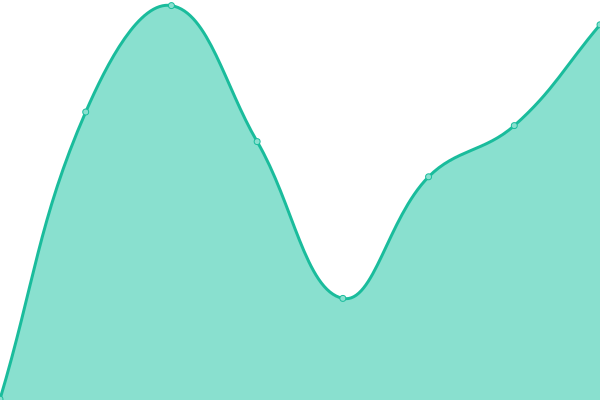
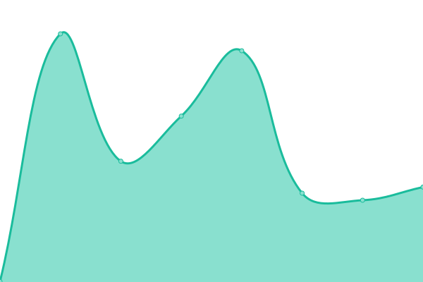

# [📈 Live Status](https://electisec.github.io/upptime/): <!--live status--> **🟧 Partial outage**

This repository contains the open-source uptime monitor and status page for [Upptime](https://upptime.js.org), powered by [Upptime](https://github.com/upptime/upptime).

<!--start: status pages-->
<!-- This summary is generated by Upptime (https://github.com/upptime/upptime) -->
<!-- Do not edit this manually, your changes will be overwritten -->
<!-- prettier-ignore -->
| URL | Status | History | Response Time | Uptime |
| --- | ------ | ------- | ------------- | ------ |
|  [Electisec Main Site](https://www.electisec.com) | 🟩 Up | [electisec-main-site.yml](https://github.com/electisec/upptime/commits/HEAD/history/electisec-main-site.yml) | 

 376ms
     
 | 

<a href="https://electisec.github.io/upptime/history/electisec-main-site">99.78%</a>
    

|  [Electisec Blog Site](https://blog.electisec.com) | 🟩 Up | [electisec-blog-site.yml](https://github.com/electisec/upptime/commits/HEAD/history/electisec-blog-site.yml) | 

 319ms
     
 | 

<a href="https://electisec.github.io/upptime/history/electisec-blog-site">100.00%</a>
    

|  [Electisec Reports Site](https://reports.electisec.com) | 🟩 Up | [electisec-reports-site.yml](https://github.com/electisec/upptime/commits/HEAD/history/electisec-reports-site.yml) | 

 240ms
     
 | 

<a href="https://electisec.github.io/upptime/history/electisec-reports-site">100.00%</a>
    

|  [electisec.tech](https://electisec.tech) | 🟥 Down | [electisec-tech.yml](https://github.com/electisec/upptime/commits/HEAD/history/electisec-tech.yml) | 

 0ms
     
 | 

<a href="https://electisec.github.io/upptime/history/electisec-tech">0.00%</a>
    

|  [blog.electisec.tech](https://blog.electisec.tech) | 🟥 Down | [blog-electisec-tech.yml](https://github.com/electisec/upptime/commits/HEAD/history/blog-electisec-tech.yml) | 

 0ms
     
 | 

<a href="https://electisec.github.io/upptime/history/blog-electisec-tech">0.00%</a>
    

|  [reports.electisec.tech](https://reports.electisec.tech) | 🟥 Down | [reports-electisec-tech.yml](https://github.com/electisec/upptime/commits/HEAD/history/reports-electisec-tech.yml) | 

 0ms
     
 | 

<a href="https://electisec.github.io/upptime/history/reports-electisec-tech">0.00%</a>
    

|  [yacademy.dev](https://yacademy.dev) | 🟩 Up | [yacademy-dev.yml](https://github.com/electisec/upptime/commits/HEAD/history/yacademy-dev.yml) | 

 284ms
     
 | 

<a href="https://electisec.github.io/upptime/history/yacademy-dev">100.00%</a>
    

|  [blog.yacademy.dev](https://blog.yacademy.dev) | 🟩 Up | [blog-yacademy-dev.yml](https://github.com/electisec/upptime/commits/HEAD/history/blog-yacademy-dev.yml) | 

 270ms
     
 | 

<a href="https://electisec.github.io/upptime/history/blog-yacademy-dev">100.00%</a>
    

|  [reports.yacademy.dev](https://reports.yacademy.dev) | 🟩 Up | [reports-yacademy-dev.yml](https://github.com/electisec/upptime/commits/HEAD/history/reports-yacademy-dev.yml) | 

 221ms
     
 | 

<a href="https://electisec.github.io/upptime/history/reports-yacademy-dev">100.00%</a>
    

|  [proxies.yacademy.dev](https://proxies.yacademy.dev) | 🟩 Up | [proxies-yacademy-dev.yml](https://github.com/electisec/upptime/commits/HEAD/history/proxies-yacademy-dev.yml) | 

 285ms
     
 | 

<a href="https://electisec.github.io/upptime/history/proxies-yacademy-dev">100.00%</a>
    

<!--end: status pages-->
